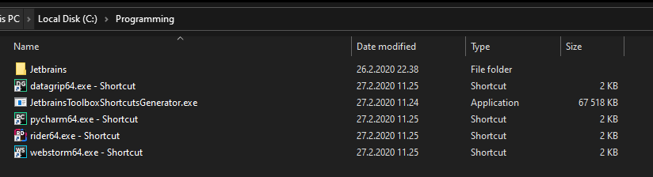

# jetbrains-toolbox-shortcuts
Jetbrains Toolbox generates a new folder every time you update a version for an application. 
Which means that it's difficult to set file associations correctly as the binary path is changed every time.

This applications is a workaround that which generates shortcuts that you can link to instead so the path is always the same.
In my case I have the shortcuts at `C:\Programming\`.
Every time an application is updated you need to run the .exe file again to update the shortcuts.


## How to use:
There are some settings you can pass to the `JetbrainsToolboxShortcutsGenerator.exe` unless you want to compile it from source and edit them there.

### Folder paths
There are 2 folder paths used for the exe file and the default for both are `Environment.CurrentDirectory` so where the exe file is located.
However if you want to change that you can run the exe file through command line and use these optional arguments:
```
JetbrainsToolboxShortcutsGenerator.exe -t "Toolbox Folder path" -l "Shortcuts folder"
```
With example data:
```
JetbrainsToolboxShortcutsGenerator.exe -t "C:\Users\User\AppData\Local\JetBrains\Toolbox\Apps" -l "C:\Users\User\Desktop"
```

It only searches maximum of 10 folders deep in case the path was incorrect so that it doesn't search the whole computer.

### Binary names
The application uses by default hardcoded binary names to generate the shortcuts.
```cs
private static List<string> Binaries = new List<string>
		{
				"datagrip64.exe", "pycharm64.exe", "rider64.exe", "webstorm64.exe", 
				// As I don't have these installed I am not sure of the binary paths:
				"clion64.exe", "goland64.exe", "idea64.exe", "phpstorm64.exe", "rubymine64.exe", 
		};
```
But that behaviour can be changed if you create a `jetbrainsbinaries.txt` in the same folder that the `JetbrainsToolboxShortcutsGenerator.exe` file is.
It will then parse each line as its own binary so if you need 32 bit pycharm you'd create the file `jetbrainsbinaries.txt` 
And write:
```
pycharm.exe
```

One final note, it clears the Binaries list so if you only write `pycharm.exe` inside the file, that's the only thing the application looks for.

## About the application
It's built using .NET Core 3.1 and the release exe file is built using the command:
`dotnet publish -r win10-x64 -p:PublishSingleFile=true`.
Which generates a 67 MB large file instead of 5 different files if you'd build it with Rider or Visual Studio.